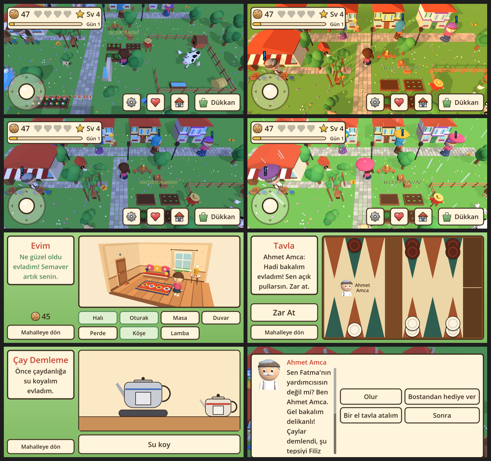

# Fatma Teyze

**MaelStoorm Studios** · © 2026 Egemen · Tüm hakları saklıdır

Metroda, otobüste, iki durak arasında oynanan sıcacık bir mahalle oyunu. Fatma Teyze ve komşuları sana her gün küçük işler verir. Mahallede dolaş, pazardan alışveriş yap, komşulara yardım et, kurabiye kazan.

## Oyunda neler var

- **Yaşayan mahalle (3D):** Dört teyze evi, Ahmet Amca'nın kahvehanesi, pazar yeri, çiftlik, gölet, dere, çiçek bahçesi, arı kovanları, elma bahçesi, ayçiçeği tarlası.
- **Yürümek:** Ekrana dokun ya da sol alttaki kolu kullan.
- **Karakterini yarat:** Kız ya da erkek, saç, ten, kıyafet ve renkler.
- **Fatma Teyze'nin işleri:** Pazar alışverişi, Komşuya Haber, Kayıp Kedi, Yemek, Altın Günü.
- **Komşular:** Filiz, Miyase, Hülya Teyze ve Ahmet Amca. Ricalarını yap, dostluk kalbi kazan, hediyeler al.
- **Sütlü:** Sarı-beyaz mahalle kedisi. Besle, peşinden gelsin.
- **Bostan:** Ek, ertesi gün topla, komşulara hediye et.
- **Gün ve hava:** Telefonun saatine göre sabah, akşam, gece; bazı günler yağmur.
- **Tavla ve çay:** Ahmet Amca'yla tavla, Filiz Teyze'yle çay demleme.
- **Evim:** Kurabiyelerinle kilim, sedir, semaver, guguklu saat al, evini döşe.
- **Dükkan:** İşleri kolaylaştıran hediyeler ve mahalle süsleri.
- Süre baskısı yok, yanlışta ceza yok. Büyük yazı ve düğmeler, ayarlanabilir yazı boyutu. İnternet gerekmez.

## Çalıştırma

1. [Godot 4.5.2](https://godotengine.org/download/archive/4.5.2-stable/) indir.
2. Godot'ta "Import" ile bu klasördeki `project.godot` dosyasını aç.
3. F5 ile çalıştır. Oyun yatay ekrandır (640x360 tasarım boyutu).

## Geliştirme

- 3D modeller `scripts/models.gd`, `props.gd`, `animals.gd`, `avatar.gd`, `ev_esyalar.gd` içinde Godot'nun hazır şekilleriyle kodla kurulur. Telefonda hız için `scripts/bake.gd` parçaları birleştirir.
- İkonlar `tools/make_icons.py`, uygulama simgesi `tools/make_app_icon.py`, logo `tools/make_logo.py`, sesler `tools/make_sounds.py` ile üretilir (Pillow/numpy gerekir).
- Hayvan sesleri gerçek CC0 kayıtlardır: `assets/sounds/HAYVAN_SESLERI_LISANS.txt`.
- Testler:
  - Günleri baştan sona oynayan test: `godot --headless -s tools/flow_test.gd`
  - Rastgele dokunuş testi: `xvfb-run godot --path . -s tools/monkey.gd -- --taps=1500`
  - Çizim yükü ölçümü: `xvfb-run godot --path . -s tools/perf.gd`
  - Ekran görüntüleri: `godot -- --shots=/klasor/yolu` (büyük yazı için `--text=1.4`)

## Android APK

1. `godot --headless --export-release "Android" build/teyze.apk`
   (Godot 4.5.2 export şablonları ve Editor Settings'te bir Android SDK yolu gerekir.)
2. `java -jar uber-apk-signer.jar -a build/teyze.apk --ks <keystore> --ksAlias teyze`

Google Play için AAB: `tools/make_aab.py` ve [docs/store/YAYINLAMA.md](docs/store/YAYINLAMA.md).

## Web sürümü (iPhone, tarayıcı)

Oyun tarayıcıda da oynanır: https://maelstoorm.github.io/teyze-1/

- iPhone'da Safari ile aç, telefonu yan çevir. **Paylaş > Ana Ekrana Ekle** ile uygulama gibi tam ekran açılır.
- Kayıt tarayıcıda saklanır; Safari verileri silinirse oyun baştan başlar.
- `main` dalına her birleştirmede `.github/workflows/web.yml` oyunu dışa aktarıp GitHub Pages'e koyar. Yerelde: `godot --headless --export-release Web build/web/index.html` (tek iş parçacıklı web şablonu, özel sunucu başlığı gerekmez).

## Sıradaki adımlar

- Gerçek gün takibi ve seri ödülleri
- Play Store hazırlığı ve uygulama içi satın alma (Google Play hesabı onaylandıktan sonra)

## Telif hakkı

**© 2026 Egemen, MaelStoorm Studios. Tüm hakları saklıdır.**

Fatma Teyze; kodu, görselleri, karakterleri ve adıyla Egemen'e (MaelStoorm Studios) aittir. Kodun burada görünmesi kullanma izni değildir: yazılı izin olmadan kopyalanamaz, değiştirilemez, yeniden yayınlanamaz, satılamaz ya da mağazalara yüklenemez. Ayrıntılar [LICENSE](LICENSE) dosyasında.

*All rights reserved. This is not open source; see [LICENSE](LICENSE).*
